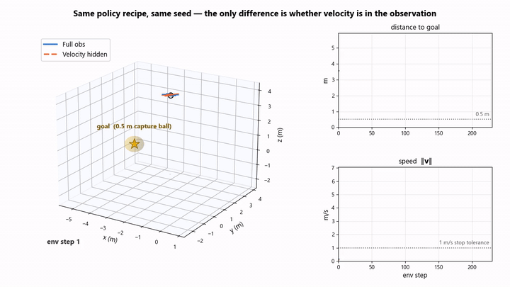
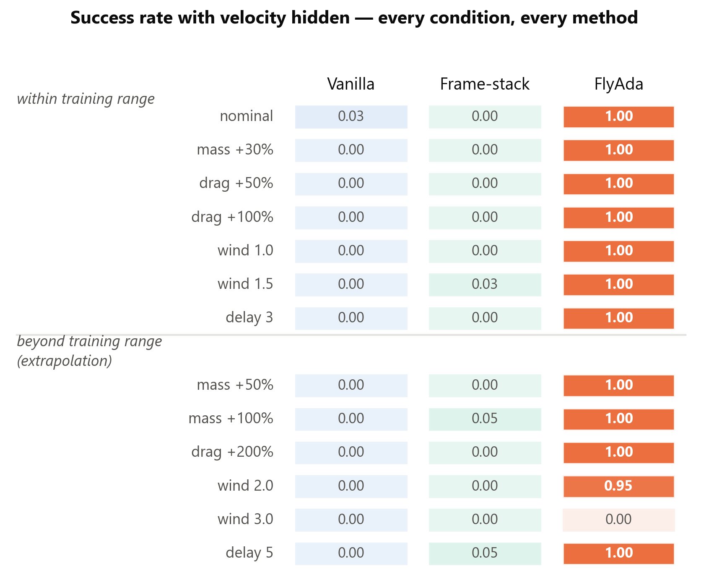
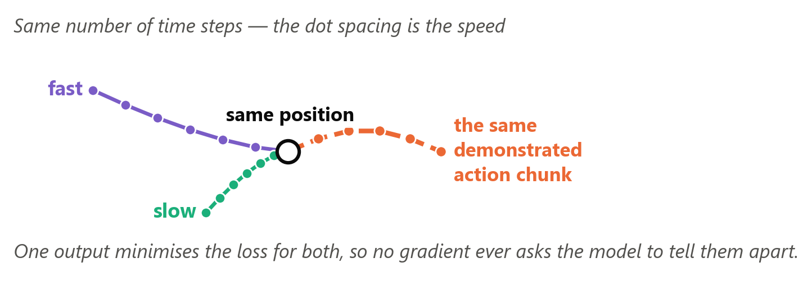
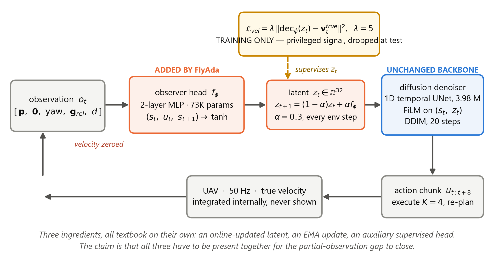
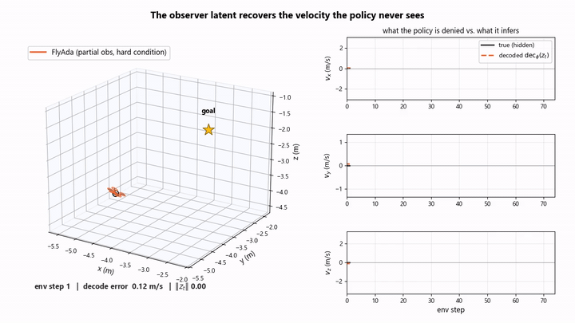
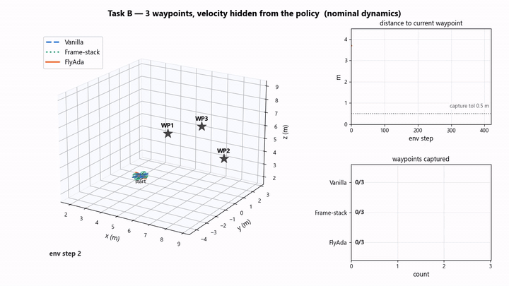
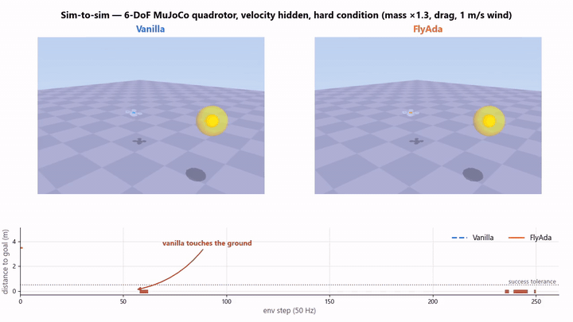

# FlyAda — Belief-State Adaptation for Diffusion Policies under Partial Observation

**WRC SARA 2026** · paper WRC26_0024 · Lingxue Lyu, University of Pennsylvania

Action-chunk diffusion policies are robust to dynamics mismatch — until you hide
one channel of the state. Then they collapse, and more observation history does
not fix it. FlyAda closes the gap with a 73 K-parameter observer whose latent is
explicitly supervised to encode the missing channel.

<p align="center">
  
</p>

Same seed, same backbone, same demonstrations. The only difference is whether
velocity is in the observation. Both accelerate toward the goal identically —
then the policy that can see velocity **brakes and stops inside the capture
ball**, and the one that cannot gets *closer in position* (0.40 m vs 0.50 m) yet
still fails, because it arrives at **1.45 m/s through a 1 m/s stop tolerance**.
It sails straight through and oscillates for the rest of the episode.

It accelerates correctly. It just cannot tell when to brake.

---

## The three findings

### 1 · Hiding velocity breaks a policy that dynamics shift could not

| Partial-observation sweep (12 conditions) | Success |
|---|---:|
| Vanilla diffusion | **0.3%** |
| 3-frame stacking | **1.1%** |
| FlyAda | **100.0%** |

Under *full* observation the same vanilla policy is at 1.00 across that sweep and
still ~0.95 an order of magnitude past the training range. The failure is not
caused by dynamics shift.

<p align="center"></p>

### 2 · The information is there; the objective never asks for it

A hand-coded finite-difference estimator recovers velocity from the same history.
But two demonstrations that reach the same position at different speeds and are
followed by the same action chunk are mapped to the same target by the diffusion
MSE loss — so nothing rewards telling them apart.

<p align="center"></p>

### 3 · Supervise a latent to hold the missing channel, and update it online

<p align="center"></p>

<p align="center">
  
</p>

Black is the true velocity the policy is never shown; orange is what we decode
from the latent, live, under mass +30%, drag +100%, wind and control delay. A
linear probe recovers velocity at **R² = 0.992**,
while a classifier from the same latent to *which* perturbation it is flying
under reaches only 24.2%
(chance 20%). The latent is the missing
state channel, not a dynamics-regime label.

---

## It holds up away from the training task

### Three waypoints, no retraining

<p align="center">
  
</p>

| Task success (all 3 waypoints) | nominal | hard |
|---|---:|---:|
| Vanilla | 0.00 | 0.00 |
| Frame-stack | 0.00 | 0.00 |
| **FlyAda** | **1.00** | **0.93** |

### Sim-to-sim: a 6-DoF MuJoCo quadrotor

<p align="center">
  
</p>

Rigid-body rotation, rotor dynamics, a 500 Hz attitude-rate PID under a 50 Hz
policy. Nothing retuned, nothing retrained. Vanilla cannot arrest its own
descent — it sinks, touches the ground and drifts away, on eleven of twelve
seeds.

| Success | nominal | hard |
|---|---:|---:|
| Vanilla | 0.00 | 0.00 |
| Frame-stack | 0.00 | 0.00 |
| **FlyAda** | **0.40** | **0.85** |

### What is actually load-bearing

Freeze the weights, change only the test-time update rule
(40 seeds, mass ×1.3, drag 0.2,
wind 1.0 m/s, delay 2):

| Variant | Success | Mean final distance |
|---|---:|---:|
| Vanilla | 0.00 | 3.13 m |
| FlyAda, latent pinned at 0 | 0.00 | 2.35 m |
| FlyAda, frozen after 10 steps | 0.00 | 3.33 m |
| **FlyAda, continuous EMA** | **1.00** | **0.39 m** |

Same weights throughout. Continuous online updating is what pays.

---

## The talk

| | |
|---|---|
| [`talk/presentation_video.mp4`](talk/presentation_video.mp4) | 9:29 presentation video, 1080p |
| [`talk/slides.pptx`](talk/slides.pptx) | 12 slides, five embedded animations |
| [`talk/script.md`](talk/script.md) | full narration with a per-slide timing table |
| [`paper/WRC26_0024_FI.pdf`](paper/WRC26_0024_FI.pdf) | the accepted paper |

## What is in here

```
paper/          the accepted camera-ready
talk/           video, slides, narration
media/
  gif/          README-sized loops of every animation
  video/        the same five animations as MP4 (H.264)
  stills/       poster frames
  figures/      every figure used in the talk
  traces/       the cached rollouts those figures were drawn from
checkpoints/    the four trained policies everything was rendered from
results/        machine-readable metrics behind every number above
envs/ models/ trainers/ eval/ data/ configs/    the implementation
figures_code/   the scripts that generated media/ from the checkpoints
```

Everything above was produced from the four checkpoints in `checkpoints/` — no
figure is a screenshot, and every number in this README is read out of
`results/` at build time rather than typed.

## Reproducing a result

```bash
pip install -r requirements.txt

# the 12-condition partial-observation sweep
python -m eval.eval_mismatch \
    --vanilla-ckpt checkpoints/vanilla_partial/diffusion_policy.pt \
    --flyada-ckpt  checkpoints/flyada_partial/flyada_policy.pt \
    --env-config configs/env_partial.yaml --n-seeds 30

# the 6-DoF sim-to-sim transfer
python -m eval.eval_mujoco_transfer
```

See [`checkpoints/README.md`](checkpoints/README.md) for loading a policy
directly. Note that `FlyAdaRolloutPolicy` is stateful — call `policy.reset()` at
the start of every episode.

The MuJoCo animation renders through `envs/mujoco_quadrotor_render.xml`, a copy
of the physics model with cosmetic geoms and lighting added.
`python -m envs._render_parity_check` asserts the two models produce
bit-identical state trajectories, including through ground contact — so nothing
in the rendered flight is an artefact of the prettier model.

## Caveats

Simulation only, no hardware. The auxiliary loss needs a true-velocity target at
training time — mild for velocity, since it is free to log even when withheld at
deployment, but it does not obviously extend to quantities you cannot instrument.
A recurrent encoder is the standard alternative and we did not run that
head-to-head.

## Citation

```bibtex
@inproceedings{lyu2026flyada,
  title     = {FlyAda: Belief-State Adaptation for Diffusion Policies
               under Partial Observation},
  author    = {Lyu, Lingxue},
  booktitle = {WRC Symposium on Advanced Robotics and Automation (SARA)},
  year      = {2026}
}
```

MIT licensed — see [LICENSE](LICENSE).
